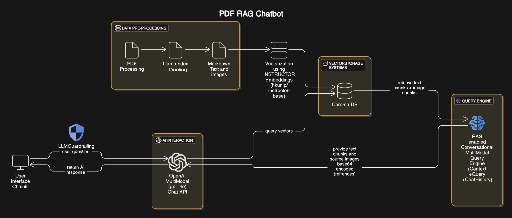

# PDF RAG Chatbot

A sophisticated PDF chatbot leveraging Retrieval-Augmented Generation (RAG) with multimodal capabilities, enabling intelligent conversations about both textual and visual content from PDF documents.

## Features

- **Advanced RAG Implementation**: Custom multimodal RAG system using LlamaIndex + Docling + Instructor Embeddings + ChromaDB + GPT-4o + LLM evaluation + Guardrails via Custom Prompt
- **PDF Processing**: Intelligent handling of PDFs including text and images
- **Text Document Processing**: Handling .docx documents to markdowns
- **XLSX Document Processing**: Handling .xlsx documents to markdowns
- **Interactive Chat Interface**: User-friendly Chainlit interface with streaming responses
- **Source Attribution**: tracking of source documents and page numbers
- **Visual Context**: Dynamic display of relevant images from PDFs
- **Conversation Memory**: Context-aware responses using chat history
- **Docker Implementation**: For easier reproduciblity of code setup for both docker and docker compose applications.

## Technical Architecture

### RAG Implementation Details

The system implements a RAG architecture with the following components:

1. **Document Processing**
   - Processes PDFs to extract both text as markdowns using Docling for .pdf, .docx and .xlsx dcouments
   - Processes documents to extract images using Docling's default OCR Easy-OCR
   - Maintains spatial relationships and document structure
   - Creates separate nodes for text and image content and create a metadata rich document for pdf

2. **Embedding System**
   - Uses Instructor Embeddings from Hugging Face "hkunlp/instructor-base" for semantic understanding
   - Custom instruction tuning for financial document context by using a custom prompt specifying the context of the document
   - Batch processing capability for efficient embedding generation

3. **Vector Storage**
   - ChromaDB as the vector store and the indexes are created using the Instructor Embeddings
   - SummaryIndex for xlsx documents and the indexes are created
   - Persistent storage for document embeddings
   - Efficient similarity search capabilities

4. **Retrieval System**
   - Top-k similarity search for relevant content using ChromaDB indexes
   - Hybrid retrieval combining text and image nodes
   - Context-aware document fetching and passing the context to the LLM for response generation via guardrails included in the QA Custom Prompt

5. **LLM Evaluation**
   - Documents retrived from the user query is evaluated using RelevancyEvaluator
   - The documents retrived and the final response provided by the LLM is evaluated using FaithfulnessEvaluator to check if the LLM didn't hallucinate and provided answers around the documents retrived from VectorIndex.

### Multimodal Conversational Query Engine

The `MultiModalConversationalEngine` is a custom implementation that handles complex multimodal interactions:

1. **Query Processing**
   ```python
   def custom_query(self, query_str: str):
       # Retrieves relevant documents
       # Processes both text and image nodes
       # Maintains conversation context
       # Returns structured response with sources and images as base64 encoded strings
   ```
2. **Image Processing**
   - Base64 encoding for frontend display
   - Maintains image metadata and relationships

3. **Context Management**
   - Chat history integration
   - Source document tracking
   - Response formatting and structuring

4. **Response Generation**
   - GPT-4o for multimodal understanding
   - Structured JSON responses via guardrails included in the QA Custom Prompt
   - Source attribution and reference tracking

## 🛠️ Technology Stack

### Backend Components
- FastAPI for API endpoints
- LlamaIndex for RAG implementation
- ChromaDB for vector storage + Instructor-base Embeddings 
- LLM evaluation using LlamaIndex using RelevancyEvaluator, FaithfulnessEvaluator

### Frontend Components
- Chainlit for interactive interface
- Dynamic base64 encoded image rendering

## 🚀 Installation

### Local Setup

1. Create a Virtual Environment and activate it:

```bash
python -m venv venv
source venv/bin/activate
```
2. Install dependencies:

```bash
pip install -r Pdf-Rag-Chatbot/requirements-new.txt
``` 
3. Clone the repository:

```bash
git clone https://github.com/yourusername/pdf-rag-chatbot.git
cd pdf-rag-chatbot
```
4. Create a `.env` file and add the environment variables:

```bash
LLAMA_API_KEY=<your_api_key_here>
OPENAI_API_KEY=<your_api_key_here>
PROJECT_PATH=<your_project_path>
```
6. Run the application frontend if you need want to run the files differently:

```bash
chainlit run app.py --port 8000 --host 0.0.0.0
```
7. Run the application backend:

```bash
uvicorn appv2:app --reload --port 8001 --host 0.0.0.0
```

8. Run the application by Docker
- Build the Docker Image 
```bash
docker build -t pdf-rag:v1 .
```

- Run the Dockerfile
```bash
docker run --gpus all --name chainlit-rag -p 8000:8000 -p 8001:8001 -e OPENAI_API_KEY=<your_api_key_here > -e LLAMA_CLOUD_API_KEY=<your_api_key_here > -e DOCLING_ARTIFACTS_PATH=/root/.cache/docling/models -v "$(pwd)/backend/chroma_db2/:/app/backend/chroma_db2/" -v "$(pwd)/backend/data_images/:/app/backend/data_images/" pdf-rag:v1
```

- You can also run the Docker-compose file:
```bash
docker-compose up -d
```

- To close the docker compose
```bash
docker-compose down
```

- To get all the logs 
```bash
docker-compose logs -f chainlit-rag
```

8. Reverse Proxy using ngrok with static domain:

```bash
ngrok http --url=<url_value> http://0.0.0.0:8000
```